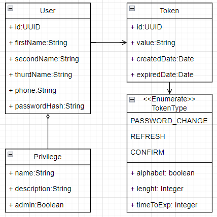
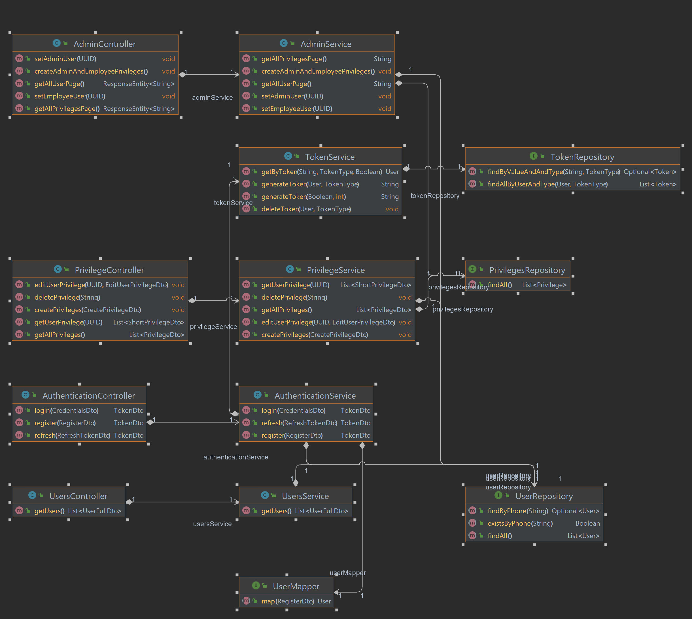

<h1>Микро-сервис Пользователи(Users)</h1>

<h3>Аннотация:</h3>

Данный микросервис создан для работы с пользователями. Его главная задача - авторизация и аунтефикация пользователей.

<h3>Архитектура и документация</h3>

[Swagger](openapi.yaml)

<h4>Документация для разработчика</h4>

Модель:

Контроллеры, репозитории, сервисы:

Автогенерируемая диаграмма.

 

Ответственный за сервис:Винниченко Иван
